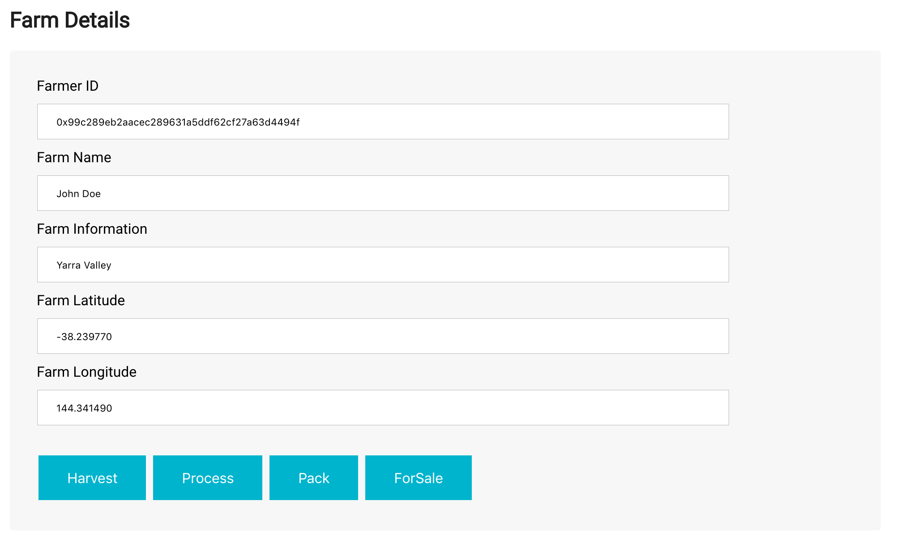
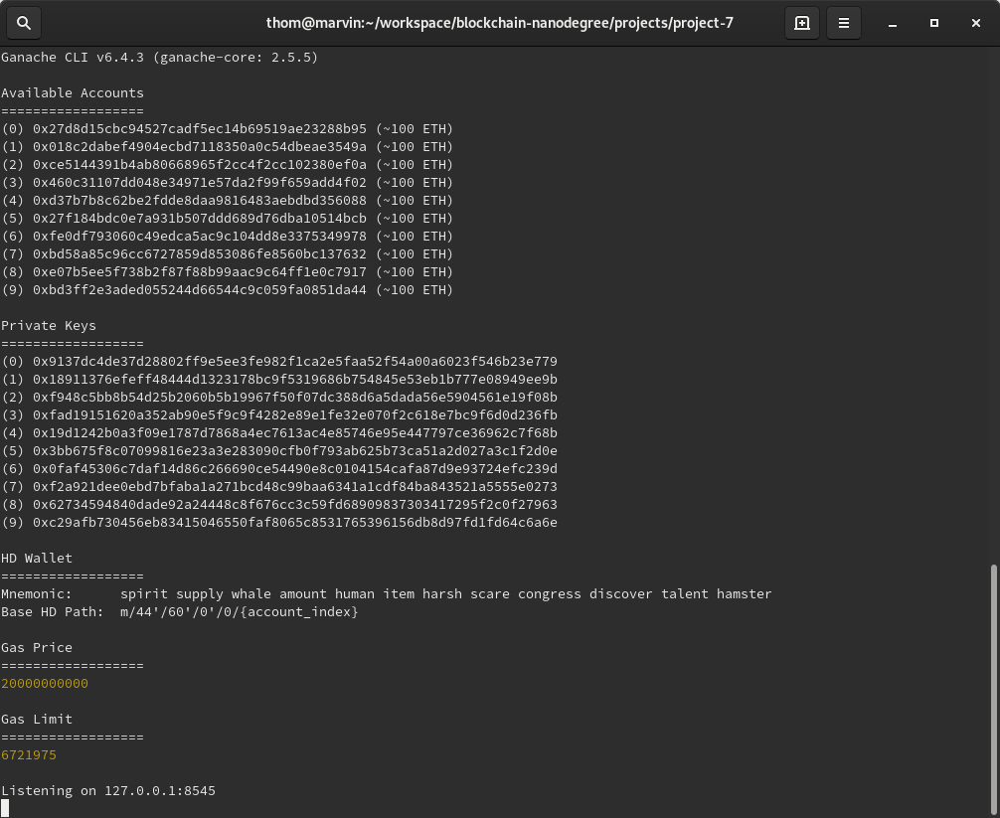
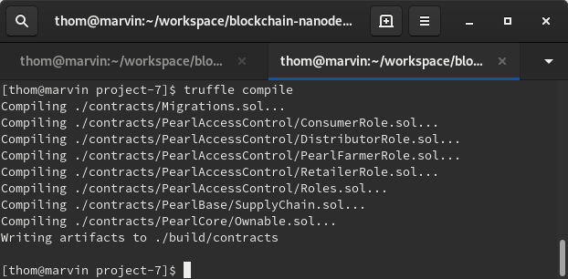
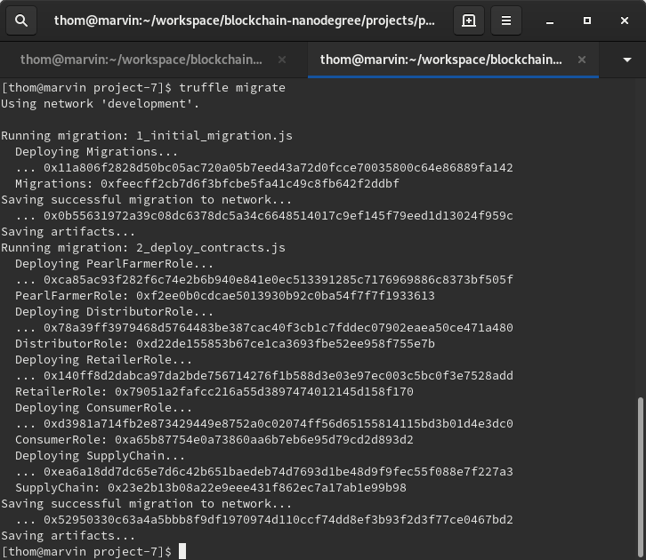
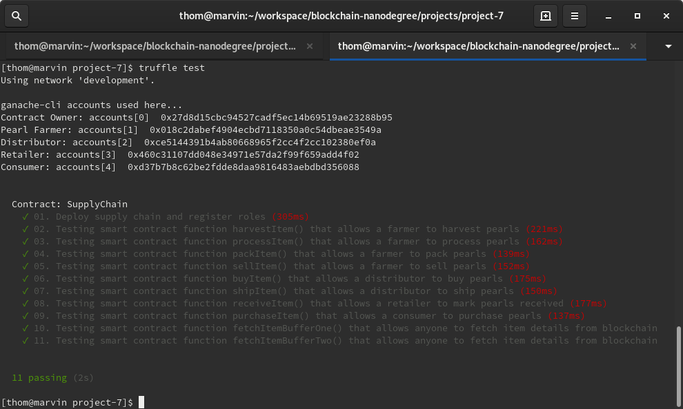

# Project 7: Ethereum DApp for Tracking Items through Supply Chain

This project implements a Pearl Supply Chain. See the following links for information on cultured pearls and oyster farming:
* https://en.m.wikipedia.org/wiki/Cultured_pearl
* https://en.m.wikipedia.org/wiki/Oyster_farming
* https://www.thepearlsource.com/blog/about-akoya-pearls/akoya-oysters-cultivation-work/

The Ethereum DApp demonstrates a Pearl Supply Chain flow between a seller and buyer. The user story is similar to any commonly used supply chain process. A seller can add items to the inventory system stored in the blockchain. A buyer can purchase such items from the inventory system. Additionally a seller can mark an item as shipped, and similarly a buyer can mark an item as received.

The DApp User Interface when running should look like this:





## UML diagrams

The diagrams folder contains the UML diagrams for the supply chain:
* Activity diagram
* Sequence diagram
* State diagram
* Classes diagram

## Getting Started

These instructions will get you a copy of the project up and running on your local machine for development and testing purposes.

### Prerequisites

Please make sure you've already installed ganache-cli, Truffle and enabled MetaMask extension in your browser.

### Installing

A step by step series of examples that tell you have to get a development environment running.

Clone this repository and install all requisite npm packages (as listed in ```package.json```):

```
npm install
```

Launch Ganache:

```
ganache-cli -m "spirit supply whale amount human item harsh scare congress discover talent hamster"
```

Your terminal should look something like this:



In a separate terminal window, Compile smart contracts:

```
truffle compile
```

Your terminal should look something like this:



This will create the smart contract artifacts in folder ```build\contracts```.

Migrate smart contracts to the locally running blockchain, ganache-cli:

```
truffle migrate
```

Your terminal should look something like this:



Test smart contracts:

```
truffle test
```

All 10 tests should pass.



In a separate terminal window, launch the DApp:

```
npm run dev
```

## Built With

* [Ethereum](https://www.ethereum.org/) - Ethereum is a decentralized platform that runs smart contracts
* [IPFS](https://ipfs.io/) - IPFS is the Distributed Web | A peer-to-peer hypermedia protocol to make the web faster, safer, and more open.
* [Truffle Framework](http://truffleframework.com/) - Truffle is the most popular development framework for Ethereum with a mission to make your life a whole lot easier.

## Versions

* Truffle v4.1.14 (core: 4.1.14)
* Solidity v0.4.24 (solc-js)
* Node v10.15.3
* IPFS v0.4.20