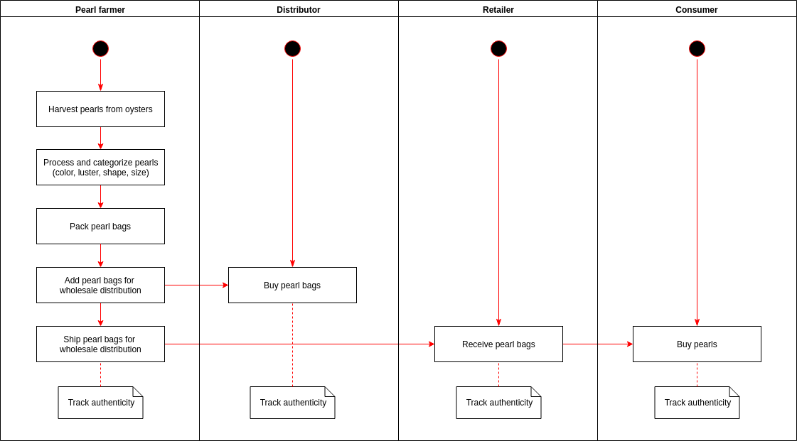
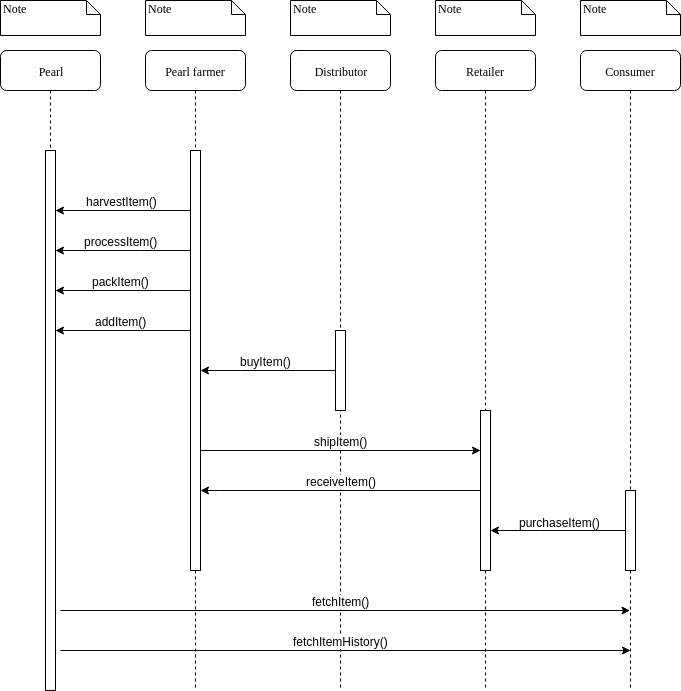
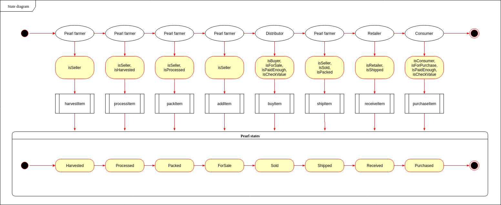
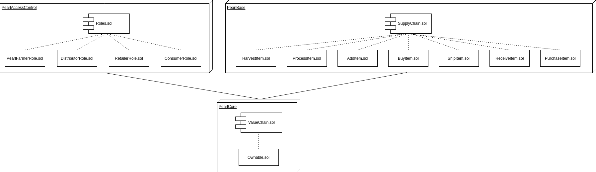
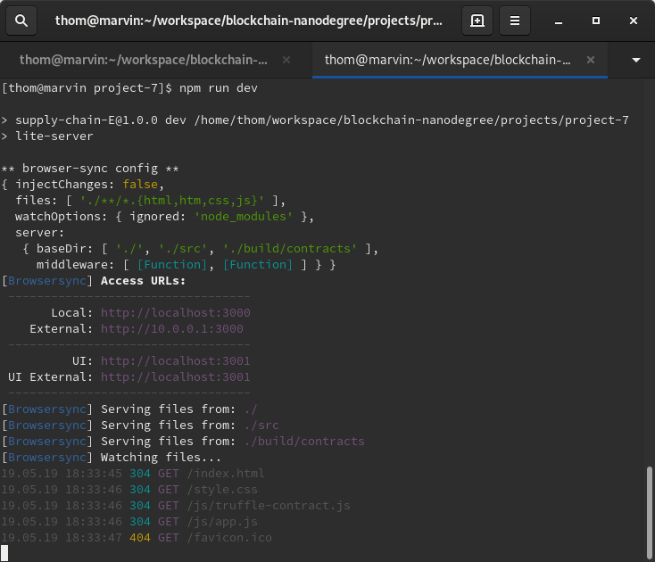

# Project 7: Ethereum DApp for Tracking Items through Supply Chain

This project implements a Pearl Supply Chain. See the following links for information on cultured pearls and oyster farming:
* https://en.m.wikipedia.org/wiki/Cultured_pearl
* https://en.m.wikipedia.org/wiki/Oyster_farming
* https://www.thepearlsource.com/blog/about-akoya-pearls/akoya-oysters-cultivation-work/

The Ethereum DApp demonstrates a Pearl Supply Chain flow between a seller and buyer. The user story is similar to any commonly used supply chain process. A seller can add items to the inventory system stored in the blockchain. A buyer can purchase such items from the inventory system. Additionally a seller can mark an item as shipped, and similarly a buyer can mark an item as received.

The DApp User Interface when running should look like this:


## UML diagrams

The diagrams folder contains the UML diagrams for the supply chain.

### Activity diagram



### Sequence diagram



### State diagram



### Classes diagram



## Getting Started

These instructions will get you a copy of the project up and running on your local machine for development and testing purposes.

### Prerequisites

Please make sure you've already installed ganache-cli, Truffle and enabled the MetaMask extension in your browser.

### Installing

A step by step series of examples that tell you have to get a development environment running.

Clone this repository and install all requisite npm packages (as listed in ```package.json```):

```
npm install
```

Launch Ganache:

```
ganache-cli -m "spirit supply whale amount human item harsh scare congress discover talent hamster"
```

Your terminal should look something like this:


In a separate terminal window, compile the smart contracts:

```
truffle compile
```

Your terminal should look something like this:


This will create the smart contract artifacts in folder ```build/contracts```.

Migrate smart contracts to the locally running blockchain, ganache-cli:

```
truffle migrate
```

Your terminal should look something like this:


Test smart contracts:

```
truffle test
```

All 11 tests should pass.


In a separate terminal window, launch the DApp:

```
npm run dev
```
Your terminal should look something like this:



## Testing the DApp in the browser

TODO

## Deploy smart contract on a public test network (Rinkeby)

The smart contract is deployed on the Ethereum Rinkeby test network:
* Transaction ID: 0x249331471a3aa5d275049cc1aae29d45449cd1ebfbc7404fd33e198d5e8cebed
* Contract address: 0xc099d8128f57f4b02d2d4aa9d8d2678a119db26f

``
[thom@marvin project-7]$ truffle migrate -f 2 --network rinkeby --reset --compile-all
Compiling ./contracts/Migrations.sol...
Compiling ./contracts/PearlAccessControl/ConsumerRole.sol...
Compiling ./contracts/PearlAccessControl/DistributorRole.sol...
Compiling ./contracts/PearlAccessControl/PearlFarmerRole.sol...
Compiling ./contracts/PearlAccessControl/RetailerRole.sol...
Compiling ./contracts/PearlAccessControl/Roles.sol...
Compiling ./contracts/PearlBase/SupplyChain.sol...
Compiling ./contracts/PearlCore/Ownable.sol...
Writing artifacts to ./build/contracts

Using network 'rinkeby'.

Running migration: 2_deploy_contracts.js
  Deploying PearlFarmerRole...
  ... 0x9d46b1ed4233d03ee17a5c51170e773cc898f35e8e72cfdf62ed233a76379c48
  PearlFarmerRole: 0x770af6ae70c6b91fbece99248ed02e11f7e1c46d
  Deploying DistributorRole...
  ... 0x32e3b2017cdaa0be35360b942c20b32b74924da151bd9a7c9b247f6e1d24ce03
  DistributorRole: 0x4e3ccf23416fce6a281a72f965f8cf822035557a
  Deploying RetailerRole...
  ... 0x81bfe536f2d28b98f5de2c8fc225c2098c5ea67626650e2d995173c42a0e9cde
  RetailerRole: 0xfcdec3967b916db509d041166ae6960354c163c5
  Deploying ConsumerRole...
  ... 0xc9cb791b0b767099e74c12a77def9f6087cfc6914450f94a8e7bf63bf30e7309
  ConsumerRole: 0x7b2d8a2c961982dffb8402ec6770a6f4e593d9c4
  Deploying SupplyChain...
  ... 0x249331471a3aa5d275049cc1aae29d45449cd1ebfbc7404fd33e198d5e8cebed
  SupplyChain: 0xc099d8128f57f4b02d2d4aa9d8d2678a119db26f
Saving artifacts...
``

You can [view the contract in Etherscan](https://rinkeby.etherscan.io/address/0xc099d8128f57f4b02d2d4aa9d8d2678a119db26f#code).

## Requirements

Graded according to the [Project Rubric](https://review.udacity.com/#!/rubrics/1710/view).

## Built With

* [Ethereum](https://www.ethereum.org/) - Ethereum is a decentralized platform that runs smart contracts
* [Truffle Framework](http://truffleframework.com/) - Truffle is the most popular development framework for Ethereum with a mission to make your life a whole lot easier.

## Versions

* Truffle v4.1.14 (core: 4.1.14)
* Solidity v0.4.24 (solc-js)
* Web3 v1.0.0-beta.55
* Node v10.15.3